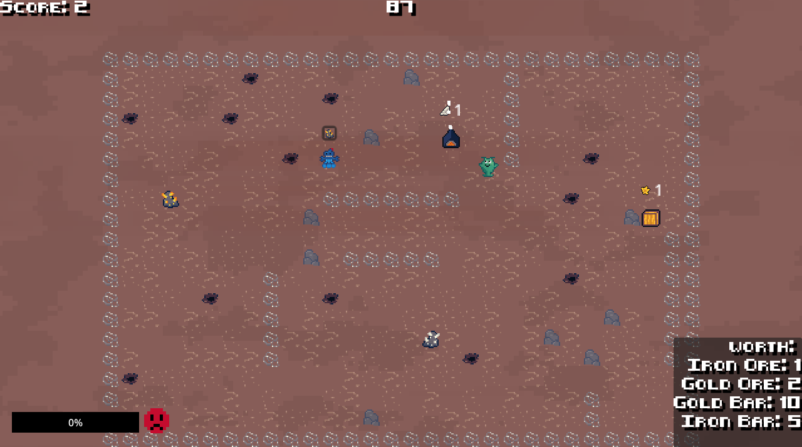

# Gloop Gloop Delivery 

[Playable link](https://gameaischool2026members.github.io/GloopGloopDelivery/GameJamAI.html)

On mars, aliens collect as much valuable resources as possible.
They are helped by their super smart robots that learn from their behaviour.
But now the robots are so smart they get bored by repetitive tasks. And bored robots don't behave like they should...

## Controls
To control the alien use wasd/arrow keys to interact with an object use e/spacebar
## Technical Description
Gloop Gloop Delivery is a Godot 4.6.3 game.
It is an experiment in collaborative AI. Your robot helper, Gloop Gloop, uses online learning to model
what the player likes to do. It then tries to complement you, and do the tasks you don't do.

However, it keeps track of its action history. If it has done the same action too often,
it will get bored and become evil. The evil robot will bother you by performing the exact same
actions as you, collapsing the economy in the progress.

